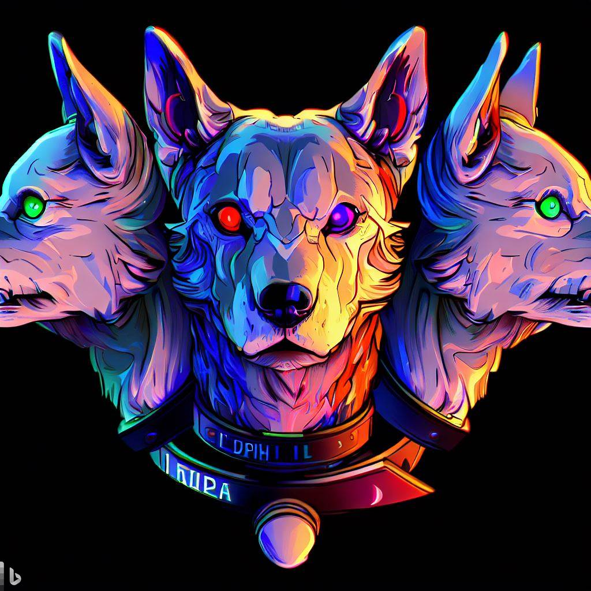

# Cerberus

My Simultaneous Localization and Mapping (SLAM) system.

There are three main components (heads) to the system, each in their respective folder:
- Visual (vis/)
- Inertial (ins/)
- LiDAR (lidar/)

The three components have a central integration point (the body).

The body will be a real time filter that integrates the data from the three heads.

From this description, I decided to name the SLAM system "Cerberus" (I was also reading a book on 
Greek mythology and liked the name).

More technical implementaion details to follow.

Generated from Bing AI

